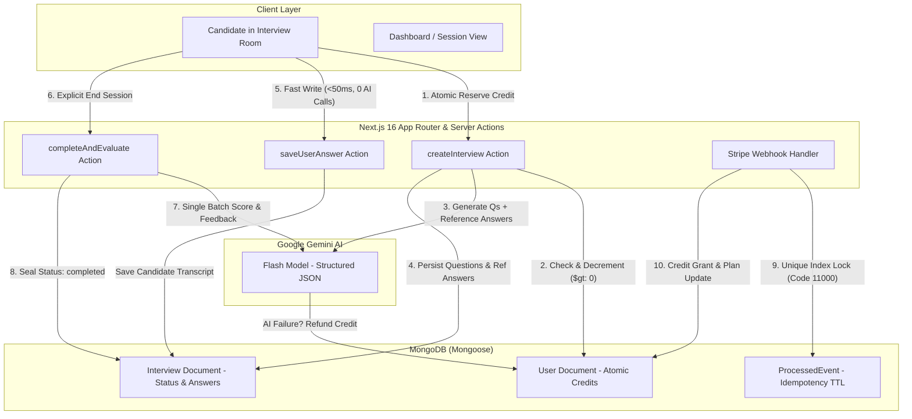

<div align="center">
  

  # 🤖 MockMate AI
  ### **Production-Hardened AI Mock Interview Platform**
  *A case study in building fault-tolerant, abuse-resistant, and cost-predictable generative AI web applications.*

  [Live Platform](https://mockmate-ai-self.vercel.app/) • [Instant Recruiter Demo (No Login)](https://mockmate-ai-self.vercel.app/demo) • [Architecture Deep Dive](#-engineering-architecture--deep-dive) • [Core File Map](#-reviewer-reading-guide)
</div>

---

## 🧭 Project Motivation & Engineering Focus

While "AI Mock Interview" projects are widespread across beginner tutorials, almost all suffer from catastrophic production flaws:
- **Cost & Quota Vulnerabilities**: Invoking LLMs on unauthenticated or free user answer iterations, allowing attackers to exhaust thousands of dollars of API quota.
- **Race Conditions**: Naive `find` then `save` credit decrements that permit concurrent double-spending.
- **Webhook Replay Bugs**: Naive Stripe webhook receivers that duplicate credits upon standard webhook retries.
- **Unbounded Client Waterfalls**: Firing mutating server actions from `useEffect` hooks, triggering double-execution in React Strict Mode and on page refreshes.

**MockMate AI was engineered specifically to solve these distributed systems and AI platform challenges.** It demonstrates production-grade Next.js 16 (App Router), React 19, Clerk authentication, Stripe billing, MongoDB concurrency control, and Google Gemini Flash orchestration.

---

## 🎯 Reviewer Reading Guide

If you are evaluating this repository for engineering rigor, examine these three files in sequence:

1. **[`README.md`](README.md)** *(this document)* — The system design rationale and architectural trade-offs.
2. **[`src/actions/interview.ts`](src/actions/interview.ts)** — Atomic reservation, compensating transactions, input sanitization, and quota abuse prevention.
3. **[`src/app/api/webhook/route.ts`](src/app/api/webhook/route.ts)** — Idempotent Stripe webhook receiver with unique-index locking and compensating replay rollbacks.

---

## 🏗️ Engineering Architecture & Deep Dive



---

### 1. Atomic Credit Reservation (Optimistic Concurrency Control)
*Reference: [`src/actions/interview.ts`](src/actions/interview.ts)*

**The Problem**: A user with 1 remaining credit opens two tabs or scripts concurrent requests to `createInterview`. A naive `User.findOne() -> check credits -> User.save()` read-modify-write pattern causes a race condition where both requests succeed, allowing double-spending.

**The Implementation**:
We use MongoDB's document-level atomic update with an optimistic predicate guard:
```ts
const dbUser = await User.findOneAndUpdate(
  { clerkId: userId, credits: { $gt: 0 } },
  { $inc: { credits: -1 } }
);
if (!dbUser) {
  return { success: false, error: "Insufficient credits." };
}
```
If two requests arrive concurrently, MongoDB's atomic lock ensures only the first request matches `{ credits: { $gt: 0 } }`. The second immediately fails and returns an insufficient credit error without needing distributed Redis locks.

---

### 2. Compensating Transactions on AI Pipeline Failures
*Reference: [`src/actions/interview.ts`](src/actions/interview.ts)*

**The Problem**: Upstream LLMs can occasionally timeout, hit rate limits, or output invalid JSON that fails schema validation. If the credit was already reserved, the candidate is penalized for a platform-level infrastructure failure.

**The Implementation**:
We implement a compensating saga step:
```ts
try {
  jsonResponse = JSON.parse(mockJsonResp);
} catch (parseError) {
  // Compensating transaction: reverse the reservation
  await refundCredit(userId);
  creditReserved = false;
  return { success: false, error: "Failed to parse AI response. Please try again." };
}
```
If Gemini fails at any point in the pipeline, the catch block guarantees a full credit refund before surfacing a clean error to the client.

---

### 3. Stripe Webhook Idempotency (At-Least-Once Delivery Defense)
*Reference: [`src/app/api/webhook/route.ts`](src/app/api/webhook/route.ts)*

**The Problem**: Stripe delivers webhooks with at-least-once delivery guarantees. Network jitter, edge timeouts, or worker restarts can cause Stripe to retry the `checkout.session.completed` event. A naive handler will increment user credits multiple times for a single payment.

**The Implementation**:
We implement an atomic idempotency lock via MongoDB unique constraints:
```ts
try {
  await ProcessedEvent.create({ eventId: event.id });
} catch (error) {
  if ((error as { code?: number })?.code === 11000) {
    // Duplicate delivery detected via unique index: acknowledge immediately
    return new NextResponse(null, { status: 200 });
  }
  return new NextResponse("Failed to record event marker", { status: 500 });
}

try {
  await User.findOneAndUpdate({ clerkId: userId }, updateOps);
} catch (error) {
  // Compensating rollback: release marker so Stripe retry can proceed
  await ProcessedEvent.deleteOne({ eventId: event.id });
  return new NextResponse("Failed to grant credits", { status: 500 });
}
```
- **Compound safety**: If MongoDB is temporarily down, the lock marker is rolled back (`deleteOne`), allowing Stripe's exponential retry backoff to fulfill the purchase.
- **TTL Hygiene**: `ProcessedEvent` has a MongoDB TTL index (`expires: 7776000` — 90 days), preventing infinite database bloat.

---

### 4. Cost & Quota Abuse Hardening (Decoupled Answering)
*Reference: [`src/actions/interview.ts`](src/actions/interview.ts)*

**The Problem**: Standard tutorial mock interview apps evaluate user answers via the LLM every single time the user submits a response during recording. An authenticated user can easily loop `saveUserAnswer` via curl, exhausting thousands of Gemini API tokens for 0 credits.

**The Implementation**:
- **Decoupled Writes**: `saveUserAnswer` is strictly a fast, bounded $O(1)$ MongoDB write (<50ms latency) that records candidate transcripts without calling Gemini.
- **State Machine Guard**: Rejects submissions if `interview.status === "completed"`.
- **Strict Invariant**: Exactly **1 Credit = 1 Question Generation Call + 1 Final Evaluation Call**. Unauthenticated or loop-based token exhaustion is physically impossible.

---

### 5. Zero-Token AI Output Reuse (Reference Answer Alignment)
*Reference: [`src/actions/interview.ts`](src/actions/interview.ts)*

**The Problem**: Most interview generators ask the AI for both questions and sample answers during interview creation, discard the sample answers, and then ask the AI to invent "ideal answers" all over again during feedback evaluation—doubling LLM output token costs and latency.

**The Implementation**:
- `createInterview` persists `idealAnswers: string[]` alongside questions.
- In `completeAndEvaluateInterview`, the pre-generated ideal answers are passed as reference context to Gemini.
- Gemini only outputs quantitative `rating` (1–10) and targeted `feedback`, slashing output token consumption by **~50%** and cutting evaluation latency in half.

---

### 6. RSC-First Data Architecture & Clean Server Boundaries
*Reference: [`src/app/dashboard/page.tsx`](src/app/dashboard/page.tsx) & [`src/app/interview/[interviewId]/feedback/page.tsx`](src/app/interview/[interviewId]/feedback/page.tsx)*

**The Problem**: Traditional client-heavy apps fire multiple sequential `useEffect` hooks on mount to fetch user credits, user plans, and interview lists, creating unsightly skeleton waterfalls and duplicate database queries.

**The Implementation**:
- **Consolidated Server Query**: `DashboardPage` executes a single parallel `Promise.all([User, Interview.find])` on the server using fast `auth().userId` (no slow outbound Clerk HTTP calls).
- **Zero Skeleton Waterfalls**: Initial interview sessions and plan statistics are streamed as server component props directly into `DashboardView` and `InterviewList`.
- **No Mutating `useEffect`**: Evaluation occurs on an explicit user button click ("End Interview"). The `/feedback` route is a pure server-rendered read from MongoDB.

---

## 🔒 Security & Input Sanitization

- **Prompt Injection Defense**: All candidate inputs (`jobPosition`, `jobDesc`, `jobExperience`, `answer`) pass through `sanitizeInput()`, stripping control characters (`\u0000-\u001F`) and markdown delimiter sequences (` ``` `).
- **Bounded Payloads**:
  - `jobPosition`: 2 to 100 characters.
  - `jobDesc`: 10 to 2,000 characters.
  - `jobExperience`: integer clamped between 0 and 50.
  - `answer`: 10 to 4,000 characters.
- **Database Indexing**:
  - `Interview`: Compound index on `{ clerkId: 1, createdAt: -1 }` eliminates full collection scans.
  - `ProcessedEvent`: Unique index on `eventId` + 90-day TTL index on `createdAt`.
  - `User`: Unique indexes on `clerkId` and `email`.

---

## 🎙️ Honest UX & Hardware Capabilities

- **Speech-to-Text with Editable Fallback**: Built on the Web Speech API. If speech recognition mishears a technical term (e.g. "Kubernetes"), candidates can immediately edit their response in the live textarea. If a browser lacks speech recognition (e.g. Firefox), the app gracefully provides direct text entry.
- **Transparent Self-Monitoring**: The camera preview is strictly for candidate presence, posture, and self-view. We explicitly clarify that no video stream is recorded or uploaded to servers.

---

## 🛠️ Tech Stack & Tooling

| Layer | Technology | Purpose |
| :--- | :--- | :--- |
| **Framework** | Next.js 16.1 (App Router, Turbopack) | Server Components, Server Actions, Edge Proxy |
| **Runtime / UI** | React 19, TypeScript 5.9 | Concurrent features, compile-time type safety |
| **Styling** | Tailwind CSS 4.0, Framer Motion | Modern dark/light interface, micro-animations |
| **Authentication** | Clerk Auth | Session tokens, route protection, user management |
| **Database** | MongoDB Atlas, Mongoose 9.1 | Document storage, atomic operators, compound indexes |
| **AI Orchestration**| Google Generative AI (`gemini-3-flash`) | Structured JSON generation & answer evaluation |
| **Payments** | Stripe SDK | Checkout sessions, webhook fulfillment |
| **Audio/Voice** | Web Speech API (`react-speech-recognition`) | In-browser live speech-to-text |

---

## 🚀 Local Development Setup

### 1. Clone & Install
```bash
git clone https://github.com/rakibhassan01/mockmate-ai.git
cd mockmate-ai
npm install
```

### 2. Configure Environment Variables
Create a `.env` file in the root directory:
```env
NEXT_PUBLIC_CLERK_PUBLISHABLE_KEY=pk_test_...
CLERK_SECRET_KEY=sk_test_...
NEXT_PUBLIC_CLERK_SIGN_IN_URL=/sign-in
NEXT_PUBLIC_CLERK_SIGN_UP_URL=/sign-up

MONGODB_URI=mongodb+srv://<username>:<password>@cluster.mongodb.net/mockmate
GEMINI_API_KEY=AIzaSy...

STRIPE_SECRET_KEY=sk_test_...
STRIPE_WEBHOOK_SECRET=whsec_...
NEXT_PUBLIC_APP_URL=http://localhost:3000
```

### 3. Run Development Server
```bash
npm run dev
```

Open [http://localhost:3000](http://localhost:3000) to view the application.

### 4. Production Build Validation
```bash
npm run build
```

---

## 📜 License

MIT License. Designed and developed with precision by [Rakib Hassan](https://rakibhassan.vercel.app).
